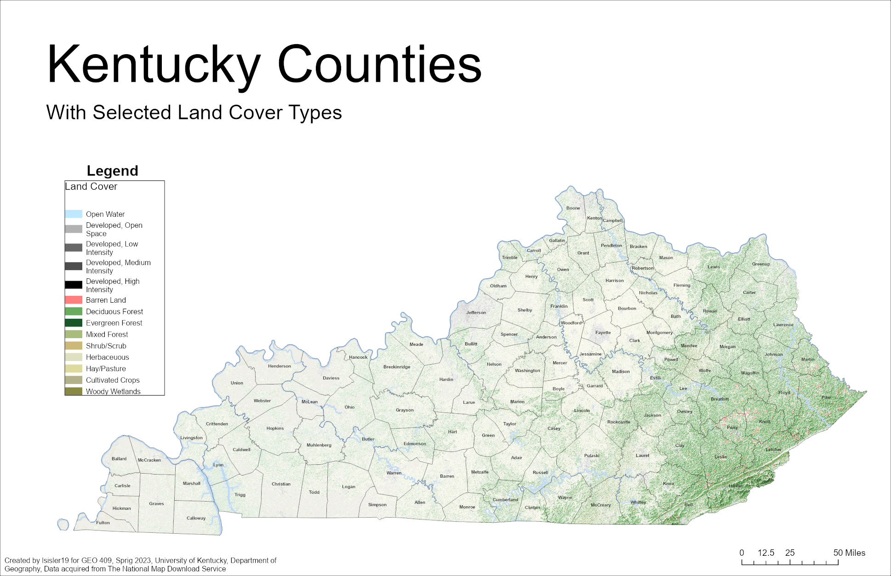
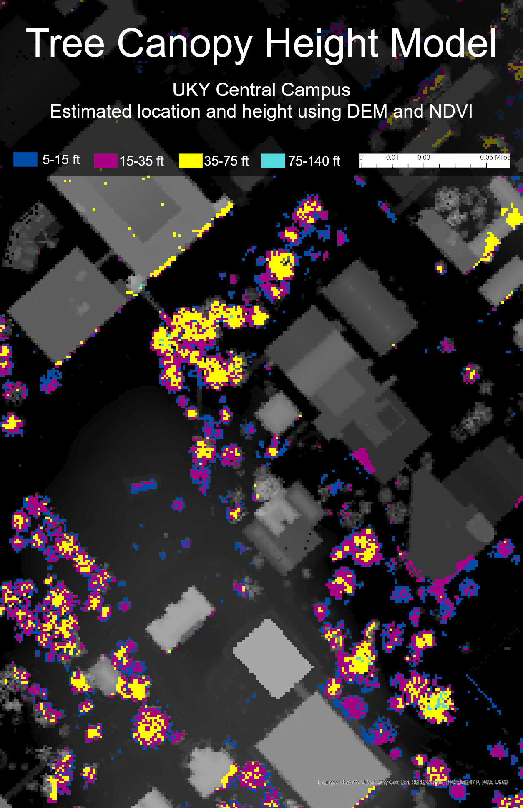

# Geo409-field-trip
Map for field trip

# GEO409 Field Trip Maps
Maps for field trip to measure tree canopy

   
Kentucky counties with selected land cover types – [Download geospatial PDF](KentuckyCounties.pdf)

   
UKy central campus canopy model – [Download geospatial PDF](TreeHeightCanopyModel.pdf)

Maps created by lsisler19 for GEO409, Spring 2023, University of Kentucky Department of Geography

